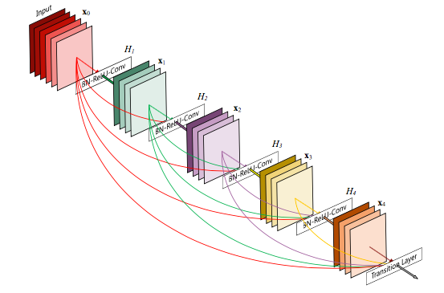
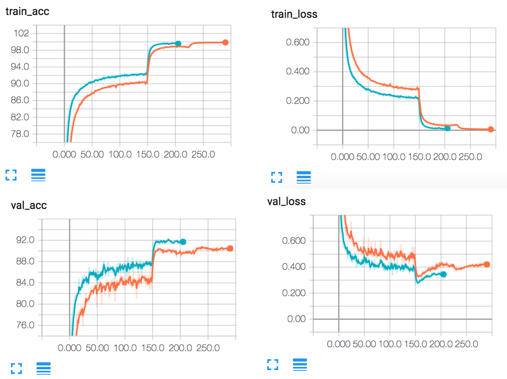

# Densely Connected Convolutional Networks

This is a PyTorch implementation of the DenseNet architecture as described in [Densely Connected Convolutional Networks](https://arxiv.org/abs/1608.06993) by G. Huang, Z. Liu, K. Weinberger, and L. van der Maaten.

<p align="center">
 
</p> 

## Requirements

* Python 3
* PyTorch (newest version)
* tqdm
* tensorboard_logger

## Usage

This implementation currently supports training on the CIFAR-10 dataset (support for CIFAR-100 and ImageNet coming soon).

Basically, when training a model, you should specify whether to use the bottleneck variant of the dense block or not `--bottleneck` and if so, what compression factor to use `--compression`. You should also specify the total number of layers `num_layers_total` in the model. By default, data augmentation is performed which means no dropout, so if you choose to turn that off, you should specify a desired dropout rate `--dropout_rate`.

Furthermore, checkpoints of the model are saved at the end of every epoch. This means that you can resume training from your latest epoch by using the `--resume=True` argument. Note that this will work only after you've run at least 1 epoch of training. When testing a model, reuse whatever command you used to train the model and add the `--is_train=False` argument. This will load the model with the best validation accuracy and test it on the test set.

Note that you can use tensorboard to view losses and accuracy by setting the `use_tensorboard` argument in which case you need to run `tensorboard --logdir=./logs/` in a separate shell.

Finally, to see all possible options, run:

```
python main.py --help
```
which will print:

```
usage: main.py [-h] [--num_blocks NUM_BLOCKS]
               [--num_layers_total NUM_LAYERS_TOTAL]
               [--growth_rate GROWTH_RATE] [--bottleneck BOTTLENECK]
               [--compression COMPRESSION] [--valid_size VALID_SIZE]
               [--batch_size BATCH_SIZE] [--num_worker NUM_WORKER]
               [--augment AUGMENT] [--shuffle SHUFFLE]
               [--show_sample SHOW_SAMPLE] [--is_train IS_TRAIN]
               [--epochs EPOCHS] [--lr LR] [--momentum MOMENTUM]
               [--weight_decay WEIGHT_DECAY] [--dropout_rate DROPOUT_RATE]
               [--random_seed RANDOM_SEED] [--data_dir DATA_DIR]
               [--ckpt_dir CKPT_DIR] [--logs_dir LOGS_DIR] [--num_gpu NUM_GPU]
               [--use_tensorboard USE_TENSORBOARD] [--resume RESUME]
               [--print_freq PRINT_FREQ]

DenseNet

optional arguments:
  -h, --help            show this help message and exit

Network:
  --num_blocks NUM_BLOCKS
                        # of Dense blocks to use in the network
  --num_layers_total NUM_LAYERS_TOTAL
                        Total # of layers in the network
  --growth_rate GROWTH_RATE
                        Growth rate (k) of the network
  --bottleneck BOTTLENECK
                        Whether to use bottleneck layers
  --compression COMPRESSION
                        Compression factor theta in the range [0, 1]

Data:
  --valid_size VALID_SIZE
                        Proportion of training set used for validation
  --batch_size BATCH_SIZE
                        # of images in each batch of data
  --num_worker NUM_WORKER
                        # of subprocesses to use for data loading
  --augment AUGMENT     Whether to apply data augmentation or not
  --shuffle SHUFFLE     Whether to shuffle the dataset after every epoch
  --show_sample SHOW_SAMPLE
                        Whether to visualize a sample grid of the data

Training:
  --is_train IS_TRAIN   Whether to train or test the model
  --epochs EPOCHS       # of epochs to train for
  --lr LR               Initial learning rate value
  --momentum MOMENTUM   Nesterov momentum value
  --weight_decay WEIGHT_DECAY
                        weight decay penalty
  --dropout_rate DROPOUT_RATE
                        Dropout rate used with non-augmented datasets

Misc:
  --random_seed RANDOM_SEED
                        Seed to ensure reproducibility
  --data_dir DATA_DIR   Directory in which data is stored
  --ckpt_dir CKPT_DIR   Directory in which to save model checkpoints
  --logs_dir LOGS_DIR   Directory in which Tensorboard logs wil be stored
  --num_gpu NUM_GPU     # of GPU's to use. A value of 0 will run on the CPU
  --use_tensorboard USE_TENSORBOARD
                        Whether to use tensorboard for visualization
  --resume RESUME       Whether to resume training from most recent checkpoint
  --print_freq PRINT_FREQ
                        How frequently to display training details on screen
```

You can edit the default values of these arguments in the `config.py` file.

Here's an example command for training DenseNet-BC-100 with a growth rate of 12, data augmentation, tensorboard visualization and with a GPU:

```
python main.py \
--num_layers_total=100 \
--bottleneck=True \
--compression=0.5 \
--num_gpu=1 \
--use_tensorboard=True
```

## Performance

I'm currently still training DenseNet-40 and DenseNet-BC-100 variants on CIFAR-10 with data augmentation so the final test results are not available, but here are some tensorboard visualizations so far.

<p align="center">
 
</p> 

From looking at the losses and accuracies, it seems decreasing the learning rate at earlier times than mentioned in the paper can shorten the training time by a large factor. I'll be testing this intuition and report my findings at a later date.

## References

* Thanks to [Taehoon Kim](https://github.com/carpedm20) for inspiring the general file hierarchy and layout of this project.
* Thanks to the PyTorch ImageNet [training example](https://github.com/pytorch/examples/tree/master/imagenet) for helping me code the Trainer class.